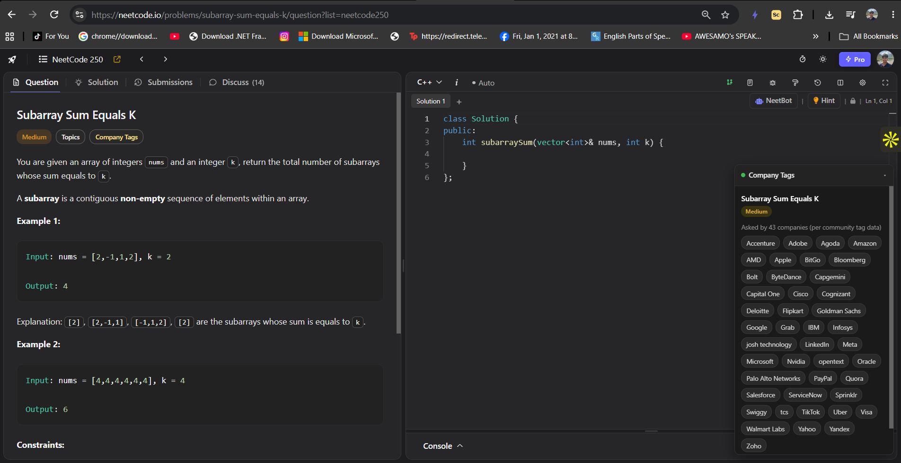

# NeetCode Company Tags — See Which Companies Ask Each LeetCode Problem on NeetCode.io

A free, open-source Chrome extension that shows **company tags for NeetCode problems**  the same "asked by Google, Amazon, Meta…" data that LeetCode locks behind Premium, displayed right inside NeetCode's free practice interface.

If you're grinding NeetCode's free problem list for interview prep and wondering *"which companies actually ask this question?"*, this extension answers that without needing a LeetCode Premium subscription.

---

## What it does

- Detects the problem you currently have open on **neetcode.io**
- Shows a floating panel with:
  - The problem's difficulty
  - Every company known to have asked it (Google, Amazon, Meta, Microsoft, Apple, Bloomberg, Uber, and 400+ more)
  - How many companies in total have asked it
- Draggable panel — move it anywhere on screen, position is remembered
- Collapsible — tuck it away with one click when you don't need it
- Built-in manual search if a problem isn't auto-detected
- 100% local: no network requests at runtime, no tracking, no accounts, no ads

## Why this exists

NeetCode's free tier is one of the best resources for structured LeetCode / coding interview prep, but it doesn't show which companies ask each question — that data usually requires a paid LeetCode subscription. This extension fills that specific gap using a community-maintained, publicly available dataset of company-tagged LeetCode problems, so you can prioritize practicing the questions that companies you're actually interviewing with tend to ask.

## Install

This extension isn't on the Chrome Web Store (yet), so install it as an unpacked extension — it takes under a minute:

1. Download or clone this repository
2. Open `chrome://extensions` in Chrome (or any Chromium browser — Edge, Brave, Arc)
3. Turn on **Developer mode** (top right toggle)
4. Click **Load unpacked** and select the extension folder
5. Go to [neetcode.io/practice](https://neetcode.io/practice), open any problem, and the company panel will appear in the bottom-right corner

No sign-up, no configuration, no LeetCode Premium required.

## How it works

- A bundled, offline JSON dataset maps ~3,400 LeetCode problems to the companies known to have asked them
- A content script matches the problem you have open by its title (robust even when NeetCode's internal URL slug differs from LeetCode's), then renders the company list in an injected panel
- Everything runs client-side in your browser — the extension never phones home

## Data source & accuracy

Company-tag data is compiled from the community-maintained [`leetcode-company-wise-problems`](https://github.com/liquidslr/leetcode-company-wise-problems) dataset, which aggregates historically reported LeetCode company tags. Coverage is broad (~3,400 problems, 400+ companies) but not exhaustive or guaranteed current — companies' actual interview questions change over time, and this is a best-effort community signal, not an official LeetCode export.

## FAQ

**Does this work with NeetCode Pro?**
Yes — it works on any neetcode.io problem page regardless of your NeetCode subscription tier. It's independent of NeetCode itself.

**Do I need LeetCode Premium for this to work?**
No. That's the whole point — it surfaces company-tag data without needing a paid LeetCode account.

**Does it track my usage or send data anywhere?**
No. The dataset is bundled inside the extension and everything runs locally in your browser.

**Why don't some problems show any companies?**
The underlying dataset doesn't cover every problem ever asked, and very new problems may not be tagged yet. Use the built-in manual search in the panel as a fallback.

**Is this affiliated with NeetCode or LeetCode?**
No. This is an independent, unofficial community tool and isn't endorsed by either.

## Contributing

Issues and pull requests are welcome — especially for improving problem-matching accuracy or refreshing the underlying dataset.

## Repository

[View the project on GitHub](https://github.com/ZOXT/-NeetCode-Company-Tags)

## License

MIT

## Disclaimer

This is an unofficial, community-built tool, not affiliated with, endorsed by, or connected to NeetCode or LeetCode. Company-tag data reflects historical community reports and may not represent current interview practices.
